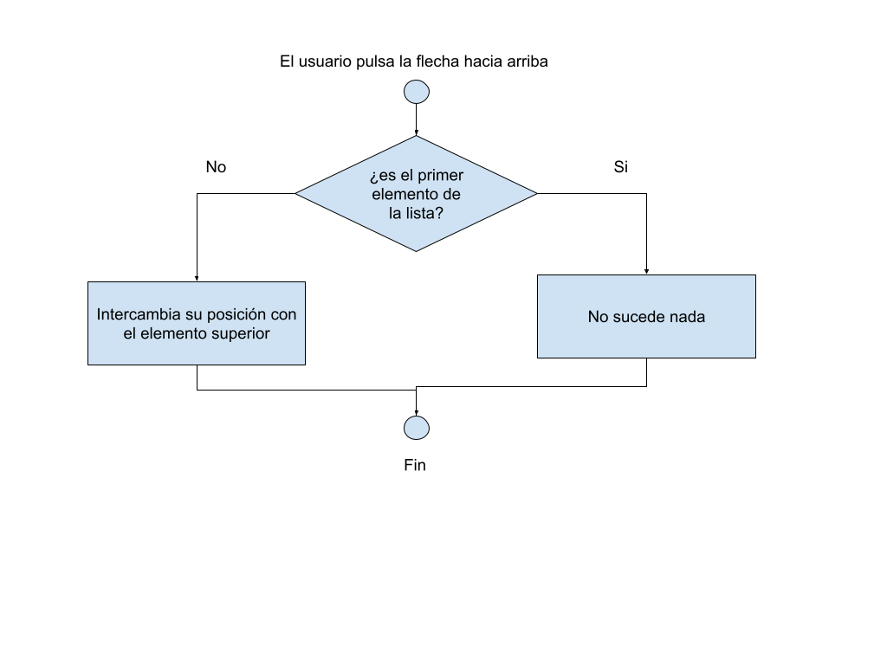

# Introducción

  1. ¿Qué es la programación?
  2. ¿Qué puedes hacer una vez sabes programar?
  3. ¿Qué es un lenguaje de programación?
  4. ¿Cómo podemos organizar nuestras lógicas?
  5. Principios de la programación y buenas prácticas

## 1. ¿Qué es la programación?

Para mi, la programación es la forma que tenemos de comunicarnos con las máquinas de forma que podamos mandarles instrucciones para que las ejecuten o para que reaccionen de alguna forma específica cuando reciben un estímulo externo.

## 2. ¿Qué puedes hacer una vez sabes programar?

A través de la programación se pueden crear una infinidad de programas y sistemas que puedan cubrir infinidad de necesidades.

La finalidad más común de la programación es la de crear programas sofware que permitan a los usuarios gestionar diferentes tipos de datos, donde estos pueden ser desde una cosa tan simple como una lista de la compra hasta las miles de transacciones de dinero que gestiona un banco cada día.

Otros usos pueden ser el análisis de datos con la intentción de encontrar patrones comunes entre ellos, como por ejemplo podría ser una lista de recomendaciones de péliculas de Netflix, que a partir de la información de las que te gustan, las compara con el resto de usuarios para ir definiendo "tu gusto".

## 3. ¿Qué es un lenguaje de programación?

Al igual que en todos los lenguajes, para poder comnunicarnos entre 2 individuos necesitamos una serie de reglas sintácticas que nos permitan analizar los mensajes y así poder interpretarlos. En la programación pasa exactamente igual, son un conjunto de reglas sintacticas que permiten a los dispositivos interpretar nuestras órdenes.

Hay dos tipos principales de lenguajes de programación según la cercanía al lenguaje maquina:

- Los lenguajes de Bajo Nivel, donde su sintaxis es directamente una orden directa en un dispositivo específico. Estos lenguajes están totalmente asociados al tipo de dispositivo porque cada uno tiene sus propias formas de funcionamiento.

- Los lenguajes de Alto Nivel, que son un nivel de abstracción por encima de los lenguajes de Bajo Nivel que nos permite a nosotros comunicarnos de una forma más cercana a la que estamos acostumbrados, siendo así un lenguajes mucho mas comprensible y sencillo. Al fin y al cabo, cuando nosotros usamos estos lenguajes siempre hay un sistema que traduce lo que decimos a un lenguajes de Bajo Nivel para que el dispositivo sea capaz de entenderlo.

Y luego también podemos clasificarlos según cual sea la forma de ejecutarse:

- Lenguaje Compilado: es aquel que pasa por una fase de compilación que lo traduce a lenguaje máquina para luego ser ejecutado.

- Lenguaje Interpretado: en este caso no se realiza ningún tratamiento previo antes de ejecutarse si no que se va traduciendo el lenguaje según se la leyendo en su ejecución.

## 4. ¿Cómo podemos organizar nuestras lógicas?

Algo muy importante en el mundo de la progamación es ser capaz de analizar un problema y sacar unos pasos a seguir para poder llegar a la solución de este. Las primeras veces que te enfrentas a esta situación es difícil saber por donde empezar y cómo ir sacando esos pasos, por ello, os voy a explicar cómo lo hago yo y con ello espero que os sirva como guía para ir empezando y poco a poco ir interiorizandolo y evolucionarlo de forma que se sienta propio.

Vamos a poner un ejemplo sencillo, imagina que quieres hacer un programa que te permita gestionar las tareas pendientes, que puedas introducir nuevas tareas, marcarlas como hechas, priorizarlas y eliminarlas. Lo primero que tenemos que ver aqui es cuantas cosas puede hacer nuestra app, y como ya las he enumerado anteriormente serían 4. Una vez sabemos que son, vamos a ir una a una viendo que es necesario para poder desarrollarlas y que es lo que esperamos de cada una de ellas.

En el caso de añadir una nueva tarea, las posibles cosas que necesitemos sean que el usuario sea capaz de introducir un titulo de la tarea, quizá una pequeña descripción por si fuera necesaria y una forma de poder decirle al sistema se puede crear correctamente.

Para marcar una como completada, lo mas importante es al menos tener una tarea ya creada, con esto podemos ver que para poder hacer esta funcionalidad primero debemos haber hecho la parte de añadir nuevas tareas. Ahora centrandonos en lo que esperamos de esta funcionalidad es que de alguna forma podamos seleccionar la tarea y luego tengamos una forma de marcarla cómo completada.

En el caso de la priorización, debemos tener al menos más de una tarea en nuestra lista, poder seleccionarla y tener una opción para mover su posición en la lista para ponera por delante o por detras de alguna otra.

Y ya, por último, la eliminación de una tarea, para este caso necesitamos al menos tener una tarea, poder seleccionarla y tener alguna forma de poder decirle al sistema que esa tarea tiene que desaparecer de la lista.

Ya tenemos todas las funciones principales de nuestra aplicación definidas y sabemos lo que un usuario necesita para realizarlas y lo que espera de ellas. Ahora vamos a entrar en el detalle de como podemos implementar una de esas funcionalidades. Para ello vamos a coger la funcionalidad de la priorización, que creo que es la que más caminos lógicos. Imaginemos que la forma que tiene el usuario para priorizar las tareas es usando unas flechas que hay en la pantalla, vamos a analizar que debería pasar si pulsa la flecha que apunta hacia arriba. Para ello vamos a dibujar un pequeño diagrama.

Este tipo de diagrámas nos va a ser muy útil de aquí en adelante ya que nos permite, de una forma muy sencilla, organizar las lógicas a nivel visual para que sean fácil de seguir.

## 5. Principios de la programación y buenas prácticas
